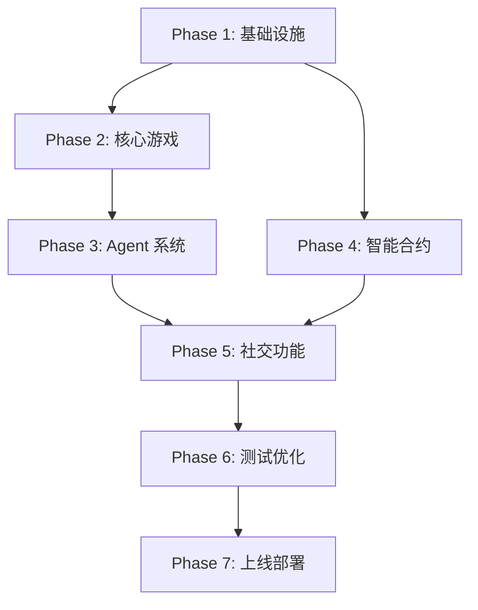

# 实施路线图和里程碑

> **版本**: v1.0 | **预计周期**: 8-10 周

---

## 📋 目录

1. [开发阶段划分](#开发阶段划分)
2. [详细里程碑](#详细里程碑)
3. [依赖关系图](#依赖关系图)
4. [团队分工建议](#团队分工建议)
5. [风险评估](#风险评估)
6. [测试和部署计划](#测试和部署计划)

---

## 开发阶段划分

### 阶段概览

```
Phase 1: 基础设施搭建 (Week 1-2)
    ↓
Phase 2: 核心游戏逻辑 (Week 3-4)
    ↓
Phase 3: Agent 系统 (Week 5-6)
    ↓
Phase 4: 智能合约开发 (Week 5-7, 并行)
    ↓
Phase 5: 社交和高级功能 (Week 7-8)
    ↓
Phase 6: 测试和优化 (Week 9-10)
    ↓
Phase 7: 上线部署
```

---

## 详细里程碑

### Phase 1: 基础设施搭建 (Week 1-2)

**目标**: 搭建开发环境，完成数据库和认证系统

#### Week 1: 项目初始化

**任务清单**:
- [ ] 初始化 Next.js 14 项目
  ```bash
  npx create-next-app@latest agentfarmx --typescript --tailwind --app
  ```
- [ ] 安装核心依赖
  ```bash
  npm install prisma @prisma/client next-auth siwe ethers@6
  npm install @upstash/redis @vercel/postgres
  npm install -D tsx
  ```
- [ ] 配置 TypeScript 和 ESLint
- [ ] 设置 Git 仓库和分支策略
- [ ] 创建 `.env.local.example`

**交付物**:
- ✅ 可运行的 Next.js 项目
- ✅ 完整的依赖配置
- ✅ 代码规范文档

#### Week 2: 数据库和认证

**任务清单**:
- [ ] 实现 Prisma Schema (参考 `01-DATABASE-SCHEMA.md`)
- [ ] 配置 Vercel Postgres 连接
- [ ] 执行初始数据库迁移
  ```bash
  npx prisma migrate dev --name init
  ```
- [ ] 实现 NextAuth.js + SIWE 认证
- [ ] 创建用户注册流程
- [ ] 实现钱包连接 (EIP-6963)

**交付物**:
- ✅ 完整的数据库 Schema
- ✅ 可用的认证系统
- ✅ 用户注册和登录功能

**验收标准**:
- 用户可以通过钱包登录
- 数据库表结构符合设计
- 所有索引已创建

---

### Phase 2: 核心游戏逻辑 (Week 3-4)

**目标**: 实现农场核心玩法

#### Week 3: 农场基础功能

**任务清单**:
- [ ] 实现农场状态 API (`/api/game/farm/state`)
- [ ] 实现种植功能 (`/api/game/farm/plant`)
- [ ] 实现收获功能 (`/api/game/farm/harvest`)
- [ ] 实现土地解锁 (`/api/game/farm/unlock`)
- [ ] 创建游戏配置系统 (作物数据)
- [ ] 实现背包系统 API

**交付物**:
- ✅ 完整的农场 CRUD API
- ✅ 作物生长逻辑
- ✅ 背包管理功能

#### Week 4: 能量系统和定时任务

**任务清单**:
- [ ] 实现能量恢复逻辑
- [ ] 创建能量恢复 Cron Job
- [ ] 创建作物成熟检测 Cron Job
- [ ] 配置 `vercel.json` Cron 设置
- [ ] 实现经验和等级系统
- [ ] 创建交易记录系统

**交付物**:
- ✅ 自动能量恢复
- ✅ 作物成熟通知
- ✅ 完整的游戏经济循环

**验收标准**:
- 用户可以种植和收获作物
- 能量自动恢复
- 经验和等级正确计算

---

### Phase 3: AI Agent 系统 (Week 5-6) ⭐ ENHANCED

**目标**: 实现 AI Agent 管理和 LLM 决策引擎

#### Week 5: Agent 基础架构 + Skills 系统

**任务清单**:
- [ ] 设计 AI Agent 执行引擎架构
- [ ] 实现 Agent 创建 API (暂不连接链上)
- [ ] 实现 Agent 启动/停止功能
- [ ] **创建 Agent Skills 数据库表** ⭐ NEW
- [ ] **实现核心 Skills (5-10 个)** ⭐ NEW
  - Farming Skills: plant_crop, harvest_crop, analyze_farm_state
  - Trading Skills: check_market_prices, sell_item
  - Social Skills: visit_friend, water_friend_crop
  - Strategy Skills: optimize_planting_schedule, risk_assessment
- [ ] **实现 Skills 管理 API** ⭐ NEW
- [ ] 实现 Agent 日志记录
- [ ] 创建 SSE 日志流 API

**交付物**:
- ✅ Agent CRUD API
- ✅ **Skills Registry 系统** ⭐ NEW
- ✅ **5-10 个可用 Skills** ⭐ NEW
- ✅ 实时日志流

#### Week 6: LLM 决策引擎

**任务清单**:
- [ ] **集成 OpenAI/Claude API** ⭐ NEW
- [ ] **实现 LLM 决策引擎** ⭐ NEW
  - 提示词工程
  - Function Calling 集成
  - 上下文收集
- [ ] **实现 AI 决策 API** ⭐ NEW
  - `/api/agents/[id]/decide` - 触发决策
  - `/api/agents/[id]/execute-decision` - 执行决策
  - `/api/agents/[id]/decisions` - 决策历史
- [ ] **实现决策缓存机制** ⭐ NEW
- [ ] 创建 Agent 心跳检测 Cron Job
- [ ] 实现 Agent 性能统计
- [ ] **创建 AI Agent 控制面板 UI** ⭐ NEW
  - 决策可视化
  - Skills 使用统计
  - 成本监控

**交付物**:
- ✅ **LLM 决策引擎** ⭐ NEW
- ✅ **AI 决策 API** ⭐ NEW
- ✅ Agent 健康监控
- ✅ **成本和性能追踪** ⭐ NEW

**验收标准**:
- Agent 可以通过 LLM 智能决策
- Skills 可以被 LLM 正确调用
- 决策理由清晰可见
- 成本控制在预算内 (每 Agent 每天 < $0.50)
- 心跳检测正常工作
- 日志实时推送

---

### Phase 4: 智能合约开发 (Week 5-7, 并行)

**目标**: 开发和部署智能合约

#### Week 5: 合约开发环境

**任务清单**:
- [ ] 初始化 Hardhat 项目
  ```bash
  cd contracts && npx hardhat init
  ```
- [ ] 安装 OpenZeppelin 和依赖
  ```bash
  npm install @openzeppelin/contracts @account-abstraction/contracts
  npm install @chainlink/contracts
  ```
- [ ] 配置 X Layer 网络
- [ ] 实现 FarmToken 合约
- [ ] 编写 FarmToken 单元测试

**交付物**:
- ✅ Hardhat 开发环境
- ✅ FarmToken 合约 (ERC-20)
- ✅ 完整的单元测试

#### Week 6: Agent 和抽奖合约

**任务清单**:
- [ ] 实现 AgentFactory 合约 (ERC-4337)
- [ ] 实现 AgentAccount 合约
- [ ] 实现 RaffleContract 合约 (Chainlink VRF)
- [ ] 编写集成测试
- [ ] 部署到测试网

**交付物**:
- ✅ AgentFactory 合约
- ✅ RaffleContract 合约
- ✅ 测试网部署

#### Week 7: 合约集成和验证

**任务清单**:
- [ ] 集成合约到 Next.js 后端
- [ ] 实现链上 Agent 创建流程
- [ ] 实现抽奖参与和开奖
- [ ] 合约安全审计 (自审)
- [ ] 部署到主网
- [ ] 验证合约源码

**交付物**:
- ✅ 链上链下数据同步
- ✅ 主网合约部署
- ✅ 验证的合约代码

**验收标准**:
- 合约通过所有测试
- 链上操作正常
- Gas 优化完成

---

### Phase 5: 社交和高级功能 (Week 7-8)

**目标**: 实现社交系统和高级功能

#### Week 7: 社交功能

**任务清单**:
- [ ] 实现好友系统
- [ ] 实现访问好友农场
- [ ] 实现浇水功能
- [ ] 实现偷菜功能
- [ ] 创建邀请系统
- [ ] 实现排行榜

**交付物**:
- ✅ 完整的社交 API
- ✅ 邀请奖励机制
- ✅ 实时排行榜

#### Week 8: 高级功能

**任务清单**:
- [ ] 实现 x402 支付协议
- [ ] 创建 Boost 道具系统
- [ ] 实现每日任务
- [ ] 创建成就系统
- [ ] 实现数据统计面板

**交付物**:
- ✅ 支付协议集成
- ✅ 道具商店
- ✅ 任务和成就系统

**验收标准**:
- 社交互动正常
- 支付流程完整
- 数据统计准确

---

### Phase 6: 测试和优化 (Week 9-10)

**目标**: 全面测试和性能优化

#### Week 9: 功能测试

**任务清单**:
- [ ] 编写 E2E 测试 (Playwright)
- [ ] 执行压力测试 (k6)
- [ ] 修复发现的 Bug
- [ ] 优化数据库查询
- [ ] 实现 Redis 缓存策略
- [ ] 优化 API 响应时间

**测试覆盖**:
- 认证流程
- 游戏核心逻辑
- Agent 执行
- 社交互动
- 智能合约交互

#### Week 10: 性能优化和文档

**任务清单**:
- [ ] 前端性能优化 (Lighthouse)
- [ ] 图片和资源优化
- [ ] 实现 CDN 缓存
- [ ] 编写 API 文档
- [ ] 编写用户手册
- [ ] 创建运维文档

**交付物**:
- ✅ 完整的测试报告
- ✅ 性能优化报告
- ✅ 完整的项目文档

**验收标准**:
- 测试覆盖率 > 80%
- API 响应时间 < 500ms
- Lighthouse 分数 > 90

---

### Phase 7: 上线部署

**目标**: 正式上线和监控

**任务清单**:
- [ ] 配置生产环境变量
- [ ] 部署到 Vercel Production
- [ ] 配置域名和 SSL
- [ ] 设置监控告警 (Sentry)
- [ ] 配置日志收集
- [ ] 准备上线公告
- [ ] 执行灰度发布

**上线检查清单**:
- [ ] 数据库备份已配置
- [ ] 环境变量已设置
- [ ] Cron Jobs 正常运行
- [ ] 智能合约已验证
- [ ] 监控系统已就绪
- [ ] 回滚方案已准备

---

## 依赖关系图



**关键路径**:
1. 基础设施 → 核心游戏 → Agent 系统 → 测试 → 上线
2. 智能合约可以并行开发，在 Phase 5 前完成集成

---

## 团队分工建议

### 推荐团队配置 (5-6 人)

| 角色 | 人数 | 职责 |
|------|------|------|
| **全栈工程师** | 2 | Next.js 开发，API 实现 |
| **智能合约工程师** | 1 | Solidity 开发，合约测试 |
| **前端工程师** | 1 | UI/UX 实现，组件开发 |
| **DevOps 工程师** | 1 | 部署，监控，CI/CD |
| **测试工程师** | 1 | 测试用例，自动化测试 |

### 分工矩阵

| Phase | 全栈 | 合约 | 前端 | DevOps | 测试 |
|-------|------|------|------|--------|------|
| Phase 1 | 🔴 | - | 🟡 | 🔴 | - |
| Phase 2 | 🔴 | - | 🔴 | 🟡 | 🟡 |
| Phase 3 | 🔴 | - | 🔴 | 🟡 | 🟡 |
| Phase 4 | 🟡 | 🔴 | - | 🟡 | 🟡 |
| Phase 5 | 🔴 | 🟡 | 🔴 | 🟡 | 🟡 |
| Phase 6 | 🟡 | 🟡 | 🟡 | 🔴 | 🔴 |
| Phase 7 | 🟡 | - | 🟡 | 🔴 | 🟡 |

🔴 主要负责 | 🟡 协助支持

---

## 风险评估

### 技术风险

| 风险 | 概率 | 影响 | 缓解措施 |
|------|------|------|----------|
| **ERC-4337 集成复杂** | 中 | 高 | 提前研究，使用成熟库，预留缓冲时间 |
| **Chainlink VRF 延迟** | 低 | 中 | 设计异步处理，用户友好提示 |
| **Vercel Cron 限制** | 中 | 中 | 优化任务执行时间，考虑外部 Cron |
| **数据库性能瓶颈** | 中 | 高 | 索引优化，Redis 缓存，读写分离 |
| **智能合约安全漏洞** | 低 | 高 | 代码审计，单元测试，限额机制 |

### 进度风险

| 风险 | 概率 | 影响 | 缓解措施 |
|------|------|------|----------|
| **需求变更** | 高 | 中 | 敏捷开发，MVP 优先，版本迭代 |
| **人员流动** | 低 | 高 | 文档完善，代码规范，知识共享 |
| **第三方服务故障** | 低 | 中 | 多云备份，降级方案 |

---

## 测试和部署计划

### 测试策略

#### 1. 单元测试 (Jest)

```bash
# 运行单元测试
npm run test

# 覆盖率报告
npm run test:coverage
```

**目标覆盖率**: > 80%

#### 2. 集成测试 (Supertest)

```typescript
// 示例: API 集成测试
describe('POST /api/game/farm/plant', () => {
  it('should plant a crop', async () => {
    const response = await request(app)
      .post('/api/game/farm/plant')
      .send({ plotId: '123', cropId: 'Apple' })
      .expect(200);
    
    expect(response.body.cropId).toBe('Apple');
  });
});
```

#### 3. E2E 测试 (Playwright)

```typescript
// 示例: 端到端测试
test('user can plant and harvest crop', async ({ page }) => {
  await page.goto('/farm');
  await page.click('[data-testid="plot-0"]');
  await page.click('[data-testid="plant-apple"]');
  
  // 等待作物成熟
  await page.waitForTimeout(180000);
  
  await page.click('[data-testid="harvest"]');
  await expect(page.locator('[data-testid="coins"]')).toContainText('1050');
});
```

#### 4. 压力测试 (k6)

```javascript
// 示例: 压力测试脚本
import http from 'k6/http';
import { check } from 'k6';

export let options = {
  stages: [
    { duration: '2m', target: 100 },
    { duration: '5m', target: 100 },
    { duration: '2m', target: 0 },
  ],
};

export default function () {
  let res = http.get('https://agentfarmx.vercel.app/api/game/farm/state');
  check(res, { 'status is 200': (r) => r.status === 200 });
}
```

### 部署流程

#### 1. 开发环境

```bash
# 本地开发
npm run dev

# 访问 http://localhost:3000
```

#### 2. 预览环境 (Vercel Preview)

```bash
# 每个 PR 自动部署预览
git push origin feature/new-feature

# Vercel 自动生成预览 URL
```

#### 3. 生产环境

```bash
# 合并到 main 分支
git checkout main
git merge feature/new-feature

# 推送触发自动部署
git push origin main

# 或手动部署
vercel --prod
```

### CI/CD 配置

创建 `.github/workflows/ci.yml`:

```yaml
name: CI

on:
  push:
    branches: [main, develop]
  pull_request:
    branches: [main, develop]

jobs:
  test:
    runs-on: ubuntu-latest
    steps:
      - uses: actions/checkout@v3
      - uses: actions/setup-node@v3
        with:
          node-version: '18'
      - run: npm ci
      - run: npm run lint
      - run: npm run test
      - run: npx prisma generate
      - run: npm run build

  contract-test:
    runs-on: ubuntu-latest
    defaults:
      run:
        working-directory: ./contracts
    steps:
      - uses: actions/checkout@v3
      - uses: actions/setup-node@v3
        with:
          node-version: '18'
      - run: npm ci
      - run: npx hardhat test
      - run: npx hardhat coverage
```

---

## 监控和告警

### 1. 应用监控 (Sentry)

```typescript
// src/lib/sentry.ts
import * as Sentry from '@sentry/nextjs';

Sentry.init({
  dsn: process.env.NEXT_PUBLIC_SENTRY_DSN,
  environment: process.env.NODE_ENV,
  tracesSampleRate: 1.0,
});
```

### 2. 性能监控 (Vercel Analytics)

```typescript
// src/app/layout.tsx
import { Analytics } from '@vercel/analytics/react';

export default function RootLayout({ children }) {
  return (
    <html>
      <body>
        {children}
        <Analytics />
      </body>
    </html>
  );
}
```

### 3. 日志收集

```typescript
// src/lib/logger.ts
export const logger = {
  info: (message: string, meta?: any) => {
    console.log(JSON.stringify({ level: 'info', message, meta, timestamp: new Date() }));
  },
  error: (message: string, error?: Error) => {
    console.error(JSON.stringify({ level: 'error', message, error: error?.stack, timestamp: new Date() }));
  },
};
```

---

## AI Agent 成本预算

### LLM API 成本估算

| 模型 | 成本/1K tokens | 每次决策 | 每天 (10次) | 每月 (300次) |
|------|---------------|---------|------------|-------------|
| GPT-3.5 Turbo | $0.0005 | $0.00025 | $0.0025 | $0.075 |
| GPT-4 Turbo | $0.01 | $0.005 | $0.05 | $1.50 |
| Claude 3 Haiku | $0.00025 | $0.000125 | $0.00125 | $0.0375 |
| Claude 3 Sonnet | $0.003 | $0.0015 | $0.015 | $0.45 |

**推荐配置**:
- **默认**: Claude 3 Haiku (最便宜)
- **标准**: GPT-3.5 Turbo (性价比)
- **高级**: GPT-4 Turbo (复杂决策)

### 成本优化策略

1. **决策缓存**: 相似场景复用决策 (减少 50% 调用)
2. **批量计划**: 一次生成多轮计划 (减少 80% 调用)
3. **模型降级**: 简单任务用便宜模型
4. **用户限额**: 每个 Agent 每天最多 20 次 LLM 调用

---

## 总结

### 关键成功因素

1. ✅ **严格遵循里程碑**: 按阶段交付，避免范围蔓延
2. ✅ **持续集成测试**: 每个 PR 必须通过测试
3. ✅ **文档同步更新**: 代码和文档同步维护
4. ✅ **性能优先**: 从开发初期就关注性能
5. ✅ **安全第一**: 智能合约和 API 安全审查
6. ✅ **AI 成本控制**: 监控 LLM API 使用，设置预算上限 ⭐ NEW

### 下一步行动

1. 📅 召开项目启动会，确认团队和时间表
2. 🛠️ 搭建开发环境，完成 Phase 1 Week 1 任务
3. 📊 建立项目管理看板 (Jira/Linear)
4. 📝 创建技术规范文档
5. 🚀 开始 Sprint 1 开发

---

**祝项目顺利！** 🎉
